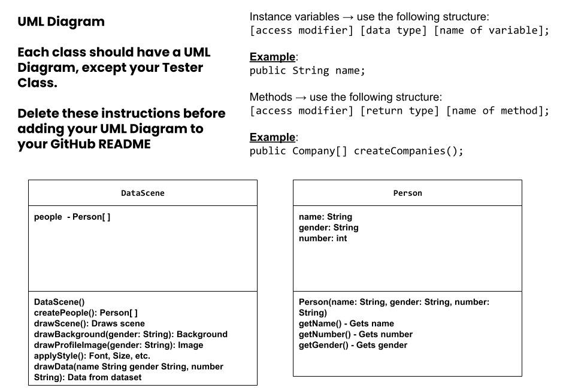
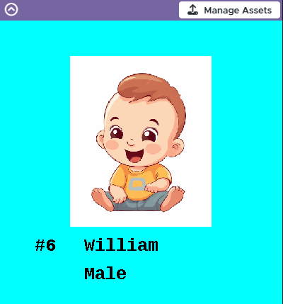

# Unit 4 - Abstract Art Project

## Introduction

Data visualizations are powerful tools to present information and convey patterns and relationships. Sometimes visualizations are charts or graphs, and other times they are more abstract pieces of art. Your goal is to create a visual representation relating at least two categories from your dataset that engages your viewer and encourages them to learn more about your chosen topic.

## Requirements

Use your knowledge of object-oriented programming, one-dimensional (1D) arrays, and algorithms to create your data visualization program:

- **Create at least two 1D arrays** – Create at least two 1D arrays to store the data that will make up your visualization.
- **Implement one or more algorithms** – Implement one or more algorithms that use two-way or multi-selection statements with compound Boolean expressions to analyze the data.
- **Use methods in the Math class** – Use one or more methods in the Math class in your program, such as to perform calculations on the values in your dataset and display the results, choose random values from the dataset, or display images or shapes at random locations.
- **Create a visualization** – Create an image or animation that conveys the story of the data by illustrating the patterns or relationships in the data.
  Note: This may be abstract! Others do not necessarily need to know what the story or pattern is right away, but you do need to be able to explain it to them.
- **Document your code** – Use comments to explain the purpose of the methods and code segments and note any preconditions and postconditions.

## Dataset

Dataset: https://www.ssa.gov/oact/babynames/    

- **Names** (String) - Name of the baby
- **Genders** (String) - Gender - Either Male or Female
- **Numbers** (int) - Top 100 in order

## UML Diagram

Put and image of your UML Diagram here. Upload the image of your UML Diagram to your repository, then use the Markdown syntax to insert your image here. Make sure your image file name is one work, otherwise it might not properly get display on this README.

## Video Demo

Record a short video of your abstract art animation to display here on your README. You can do this by:

- Screen record your project running on Code.org.
- Upload that recording to YouTube.
- Take a thumbnail for your image.
- Upload the thumbnail image to your repo.
- Use the following markdown

^Click on the image for short video demo. 

## Description

The goal of this project is to create an interactive application that allows users to explore and visualize popular baby names based on a dataset of the top 100 baby names. Using the Person class, we represent each baby name, capturing its name, gender, and ranking. As the code runs, the user is shown the baby name, ranking, and gender that the dataset provided me. The application responds dynamically, displaying relevant information and visual elements such as background color (blue for boy, pink for girl) and images (boy and girl). My project helps users discover the popular baby names recorded in the U.S., making the process both informative and engaging. Ultimately, I aimed to provide a fun platform for anyone interested in baby names or even trying to look for a baby name themselves. 